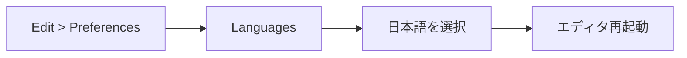

Unityエディタは標準で英語表示ですが、**公式の日本語翻訳パッケージを導入することで、以下の手順で簡単に日本語化できます**。

## 日本語化の手順フロー

## **手順**

### 1. **Unity Hubを起動**  
- Unity Hubを起動し、インストール済みのUnityエディターの設定を確認します。  
- **インストール時に日本語モジュールを追加していない場合**は、以下の手順でモジュールを追加します。  

### 2. **日本語モジュールの追加**  
1. **Unity Hubのインストールタブを開く**  
   Unity Hubの`インストール`タブで、使用中のUnityエディターの横にある歯車アイコンをクリックします。  

2. **モジュールを追加**  
   「モジュールを追加」を選択し、一覧から**Japanese Language Pack（日本語パック）**をチェックして追加します。  

### 3. **Unityエディターの言語を変更**  
1. Unityエディターを起動し、**Preferences**（設定）を開きます。  
   - メニューから `Edit > Preferences` を選択（Macの場合は `Unity > Preferences`）。  

2. **Language設定を変更**  
   - **Languages**（言語）の項目で、`Japanese` を選択します。

3. Unityエディターを再起動すると、日本語表示に切り替わります。

## **補足**

- **対応範囲**  
  日本語化によって、メニューやウィンドウの多くが日本語表記になります。ただし、一部のエラーやドキュメントなどは英語のまま表示される場合があります。

- **日本語に戻らない場合**  
  再起動後も英語のままの場合は、モジュールが正しくインストールされているか、Preferences設定が正しいかを再確認してください。

:::message
Languages（言語）の項目が出ない場合は、Unity・UnityHubの再起動をお試しください。
:::

:::message
**英語版のまま使うメリット**: AI（ChatGPTやCursor）にUnityの質問をするとき、英語のメニュー名のほうが正確に回答してもらえます。慣れてきたら英語版に戻すのもおすすめです。
:::