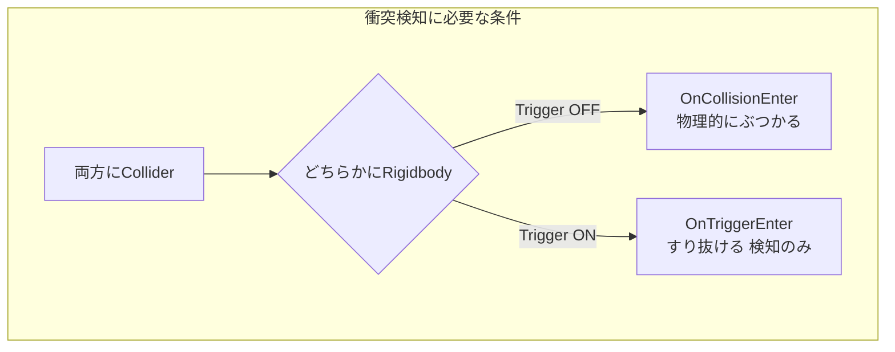

# 課題 1: タイプ相性を考慮した関数を実装しよう！

**ポケモンの「タイプ相性」を考慮したダメージ計算を行う関数を作成してください。**

## 関数の要件

### 引数:
1. int damage : 基本ダメージ量
2. string opponentType : 相手のポケモンのタイプ（"炎"、"水"、"草"のいずれか）

### 条件:
自分のポケモンのタイプを固定（例: "水"）。
相手のタイプと自分のタイプを比較し、以下の相性に応じて最終的なダメージを計算する：

効果抜群: ダメージ × 2
効果いまひとつ: ダメージ ÷ 2
それ以外: ダメージそのまま

### デバッグログ:

計算結果として、以下の情報をデバッグログに表示してください：
「相手のタイプがopponentTypeの場合、最終的なダメージはcalculatedDamageです！」

:::details ヒント : サンプルコードを見る
```csharp
int CalculateDamage(int damage, string opponentType)
{
    string myType = "水"; // 自分のポケモンのタイプを固定
    int calculatedDamage = damage;

    // タイプ相性の計算
    if (myType == "水" && opponentType == "炎")
    {
        calculatedDamage *= 2; // 効果抜群
    }
    else if (myType == "水" && opponentType == "草")
    {
        calculatedDamage /= 2; // 効果いまひとつ
    }

    Debug.Log($"相手のタイプが {opponentType} の場合、最終的なダメージは {calculatedDamage} です！");
    return calculatedDamage;
}
```
:::

>ログが正しく出力されれば成功です。

:::details ヒント : 完成したサンプルコードを見る
```csharp
using UnityEngine;

public class PokemonBattle : MonoBehaviour
{
    public string pokemonName = "ピカチュウ"; // 自分のポケモンの名前
    public string myType = "水";             // 自分のタイプ
    public int baseDamage = 50;              // 基本ダメージ

    void Start()
    {
        // テストケース1: 相手のタイプが炎
        int damageToFire = CalculateDamage(baseDamage, "炎");
        Debug.Log($"相手が炎タイプの場合、最終ダメージは {damageToFire}");

        // テストケース2: 相手のタイプが草
        int damageToGrass = CalculateDamage(baseDamage, "草");
        Debug.Log($"相手が草タイプの場合、最終ダメージは {damageToGrass}");

        // テストケース3: 相手のタイプが水
        int damageToWater = CalculateDamage(baseDamage, "水");
        Debug.Log($"相手が水タイプの場合、最終ダメージは {damageToWater}");
    }

    // タイプ相性を考慮したダメージ計算
    int CalculateDamage(int damage, string opponentType)
    {
        int calculatedDamage = damage;

        // タイプ相性の計算
        if (myType == "水" && opponentType == "炎")
        {
            calculatedDamage *= 2; // 効果抜群
        }
        else if (myType == "水" && opponentType == "草")
        {
            calculatedDamage /= 2; // 効果いまひとつ
        }

        Debug.Log($"相手のタイプが {opponentType} の場合、最終的なダメージは {calculatedDamage} です！");
        return calculatedDamage;
    }
}
```
:::

# 課題 2: キズぐすりを追加しよう！

## 1. アイテムの取得システム

### 課題内容
フィールドに配置されたアイテムをプレイヤーが近づくことで取得し、ログに取得したアイテムの名前を表示するシステムを実装してください。

### 手順
1. アイテムオブジェクトを作成
シーン内にCubeを配置し、名前をItemに変更する。
複数のItemを配置して、それぞれ名前を変更する（例: kizuGusuri, iiKizuGusuri）。

2. PokemonControllerに以下の処理を追加
プレイヤーがアイテムに触れた際にその名前を取得してログに表示する。

::: message
当たり判定(`OnTriggerEnter`)については、下記の▶︎を参考にしてください！
:::

:::details 当たり判定
# 当たり判定（コリジョン）について

ゲームでは、キャラクターやアイテム、障害物などが「接触」や「衝突」したことを検出するために当たり判定（コリジョン）が必要です。Unityでは、この判定を実現するために以下のコンポーネントを使用します。



## 必要なコンポーネント

### 1. **Collider**
- **役割**  
  オブジェクトの形状やサイズを定義し、「どこに当たり判定が発生するか」を決めるものです。オブジェクトの見た目とは別に、目に見えない物理的な枠組みを作ります。

- **主なColliderの種類**  
  - **Box Collider**: 四角い形状の当たり判定を作る。
  - **Sphere Collider**: 球状の当たり判定を作る。
  - **Capsule Collider**: カプセル状の当たり判定を作る。
  - **Mesh Collider**: オブジェクトの形状に合わせた複雑な当たり判定を作る（主に静的オブジェクトに使用）。
  - **2D Collider**: 2Dゲーム向け（例: Box Collider 2D）。

### 2. **Rigidbody**
- **役割**  
  オブジェクトに物理挙動（重力や運動）を加えるためのコンポーネントです。当たり判定で動きを正しくシミュレートするために必要です。

- **ポイント**  
  - Rigidbodyを追加すると、オブジェクトは物理エンジンによって制御されるようになります。
  - 動かないオブジェクトの場合は、`Rigidbody`を追加せず`Is Trigger`を使うことも可能です。

### 3. **Is Trigger**
- **役割**  
  Colliderのオプションとして設定できるプロパティで、衝突ではなく「通過」を検出するために使います。

- **ポイント**  
  - Is Triggerをオンにすると、物理的な衝突は発生しなくなりますが、スクリプトで接触を検知できます。
  - アイテムの取得やエリアの判定に便利です。
:::

:::details コンポーネントを設定する方法
### 1. **必要なコンポーネントを適切に設定しよう**  
- 動くオブジェクト（例: キャラクター）には **Collider** と **Rigidbody** を追加してください。
- 静的オブジェクト（例: 壁や床）には **Collider** のみを追加し、Rigidbodyは省略しても大丈夫です。

### 2. **衝突の種類を理解しよう**  
- **物理的な衝突**（ぶつかる、跳ね返るなど）を実現したい場合は、`Is Trigger`をオフにします。
- **通過判定**（触れたらアイテムを取得など）を実現したい場合は、`Is Trigger`をオンにします。

### 3. **コンポーネントの組み合わせを試そう**  
- キャラクターの動きや接触イベントの挙動が思った通りにならない場合、ColliderやRigidbodyの設定を見直しましょう。  
- 例えば、`Rigidbody`の`Use Gravity`や`Constraints`オプションを使うと、オブジェクトが重力に引かれたり、不必要に回転したりしなくなります。

### 4. **当たり判定のイベントをスクリプトで実装**  
当たり判定をスクリプトで処理するために以下のメソッドを活用してください。  
- **`OnCollisionEnter`**: 衝突したときのイベント（物理的な接触）。  
- **`OnTriggerEnter`**: トリガーに入ったときのイベント（通過判定）。  

```csharp
void OnCollisionEnter(Collision collision)
{
    Debug.Log($"衝突しました: {collision.gameObject.name}");
}

void OnTriggerEnter(Collider other)
{
    Debug.Log($"トリガーに入りました: {other.gameObject.name}");
}
```
:::

:::details OnTrigger関数とOnCollision関数の6つの種類
# OnTrigger と OnCollision の6つの種類

Unityで衝突やトリガーを扱う際に使用されるメソッドには、それぞれ以下の6つの種類があります。これらはオブジェクトの接触状態に応じて適切に使い分ける必要があります。

| **メソッド名**         | **概要**                                                                 | **用途例**                                       |
|------------------------|------------------------------------------------------------------------|-------------------------------------------------|
| `OnTriggerEnter`       | オブジェクトがトリガー領域に入った瞬間に呼び出される                     | プレイヤーが回復エリアに入ったときに回復処理を実行 |
| `OnTriggerStay`        | オブジェクトがトリガー領域内に留まっている間、毎フレーム呼び出される       | 毎秒スコアを加算するエリアの実装                 |
| `OnTriggerExit`        | オブジェクトがトリガー領域から出た瞬間に呼び出される                     | プレイヤーがエリアを離れたときに警告を表示       |
| `OnCollisionEnter`     | オブジェクトが物理的に接触した瞬間に呼び出される                         | 敵キャラクターと接触したときにダメージを与える   |
| `OnCollisionStay`      | オブジェクトが物理的に接触し続けている間、毎フレーム呼び出される           | プレイヤーが敵に押され続けている状態を検出する   |
| `OnCollisionExit`      | オブジェクトが物理的な接触から離れた瞬間に呼び出される                   | プレイヤーが壁から離れたときに移動速度をリセット |
:::

```csharp:PokemonController
using UnityEngine;

public class PokemonController : MonoBehaviour
{
    private void OnTriggerEnter(Collider other)
    {
        // アイテムタグを持つオブジェクトに触れた場合
        if (other.CompareTag("Item"))
        {
            Debug.Log($"アイテムを取得: {other.gameObject.name}");
            Destroy(other.gameObject); // アイテムを削除
        }
    }
}
```

:::message
タグについては、下記の▶︎を参考にしてください！
:::

:::details タグとは？
### タグの設定方法
1. アイテムオブジェクトを選択。
2. インスペクターで「Tag」フィールドをクリック。
3. `Item` タグがない場合は「Add Tag」を選び、新しいタグを`Item`作成します。
4. 作成したタグをオブジェクトに割り当てます。
:::

## 2.体力管理と回復システム

### 課題内容
ポケモンにHP（体力）を追加し、以下のシステムを実装してください：

・初期HPは100。
・アイテムを取得すると、HPが回復する（回復量はアイテムごとに異なる）。
・HPが最大値（100）を超えないようにする。

### 手順
#### 1.スクリプトの準備
・`PokemonHealingItems`スクリプトを作成し、HP管理のための変数と回復処理を追加します。

```csharp:PokemonHealingItems
using UnityEngine;

public class PokemonHealingItems : MonoBehaviour
{
    public int currentHP = 100; // 現在のHP
    public int maxHP = 100;     // 最大HP

    // ポケモンのHPを回復する関数
    public void HealPokemon(int healAmount)
    {
        // 回復後のHPを計算
        currentHP += healAmount;

        // 最大HPを超えないように調整
        if (currentHP > maxHP)
        {
            currentHP = maxHP;
        }

        Debug.Log($"ポケモンは {healAmount} HP 回復し、現在のHPは {currentHP} です！");
    }

    private void OnTriggerEnter(Collider other)
    {
        // アイテムタグを持つオブジェクトに触れた場合
        if (other.CompareTag("Item"))
        {
            // アイテムの回復量を取得
            int healAmount = other.GetComponent<Item>().healAmount;

            // HPを回復
            HealPokemon(healAmount);

            // アイテムを削除
            Destroy(other.gameObject);
        }
    }
}
```

#### 2. 回復アイテムのプロパティを設定
アイテムオブジェクトごとに回復量を設定するためのItemスクリプトを作成します。

ItemオブジェクトのインスペクターでhealAmountを設定します。
>例:
・kizuGusuri → healAmount = 20
・iiKizuGusuri → healAmount = 50

```csharp:Item
using UnityEngine;

public class Item : MonoBehaviour
{
    public int healAmount = 20; // 回復量
}
```

> **PokemonHealingItems**が**Item**に触れた際に、アイテムが削除され、体力が回復すれば成功です！  

> **PokemonHealingItems**を**Item**に接触させるには、以下の方法があります：
> 1. **PokemonHealingItems** に移動用のスクリプトを追加して、オブジェクトをプログラムで動かす。
> 2. **シーンビュー**で**PokemonHealingItems**がアタッチされているオブジェクトを手動で動かし、アイテムがアタッチされているオブジェクトに接触させる。

:::message alert
### システム構築の確認リスト

以下のチェックリストに沿って、システムが正しく設定されているか確認してください。

1. **`PokemonHealingItems` の設定**  
   - `PokemonHealingItems`スクリプトがアタッチされたゲームオブジェクトがシーン内に存在すること。

2. **`Item` の設定**  
   - `Item`スクリプトがアタッチされたゲームオブジェクトがシーン内に存在すること。

3. **Collider と Rigidbody の確認**  
   - 各ゲームオブジェクトに `Collider` コンポーネントが正しくアタッチされていること。
   - 少なくとも1つのオブジェクトに `Rigidbody` コンポーネントがアタッチされていること。

4. **`Is Trigger` の設定**  
   - `Collider` コンポーネントのうち、どちらか一方の `Is Trigger` にチェックが入っていること。

5. **タグの設定**
   - `Item` スクリプトがアタッチされているゲームオブジェクトに、`Item` タグが設定されていること。
     - タグの設定手順については[こちら](#タグの追加方法)を参考にしてください。
:::

:::message
**AIに聞いてみよう**: 当たり判定のコードが難しく感じたら、AIに「UnityのOnTriggerEnterの使い方を教えて」と質問してみましょう。AIが生成したコードの意味を理解しながら進めると、確実にスキルが身につきます。
:::