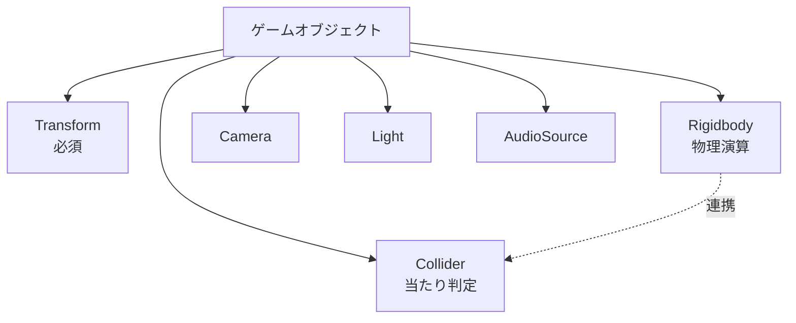
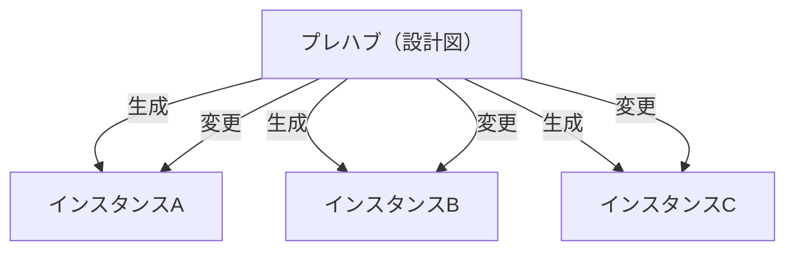

# Unityエディタの使い方：主要ビューをマスターしよう

Unityエディタには、開発をサポートするための複数のビュー(ウィンドウ)があります。以下に各ビュー(ウィンドウ)の概要を示します。

### 1. シーンビュー (Scene View)
シーンビューは、ゲームの3Dや2Dシーンを視覚的に構築し、操作するためのウィンドウです。オブジェクト[^1]の追加、配置、変形（移動、回転、スケーリング）が可能で、カメラの視点を調整して異なる角度からシーンを確認できます。

### 2. ゲームビュー (Game View)
ゲームビューでは、実際にゲームがどのように表示されるかをプレビューできます。開発中にゲームを実行し、プレイヤーの視点からテストするために使用します。

:::message
シーンビューとゲームビューを間違えないように注意（シーンビューは構築、ゲームビューはプレビュー）。
:::

### 3. ヒエラルキービュー (Hierarchy View)
ヒエラルキービューは、現在のシーン内のすべてのゲームオブジェクト[^1]のリストを表示します。オブジェクトの構造や親子関係を管理し、選択したオブジェクトをシーンビューやインスペクタビューで編集できます。

### 4. インスペクタビュー (Inspector View)
インスペクタビューでは、選択したゲームオブジェクトやアセットのプロパティを表示・編集できます。コンポーネントの追加、削除、設定の変更が可能です。

### 5. プロジェクトビュー (Project View)
プロジェクトビューでは、プロジェクトに含まれるすべてのアセット（スクリプト、画像、音声ファイルなど）を管理します。新しいフォルダやアセットを作成し、整理を行います。

# ゲームの基本パーツ：ゲームオブジェクトを理解しよう

**Unityにおける「ゲームオブジェクト」とは、ゲームの中で使用するすべての要素の「基本的なパーツ」のことです**。

キャラクター、背景、アイテム、カメラ、さらには音楽やエフェクトなど、ゲームに登場するあらゆるものがゲームオブジェクトとして扱われます。

# Unityで扱う3Dオブジェクト：基本形状の活用方法
| オブジェクト | 用途 |
|---------------|------|
| **キューブ (Cube)** | 建物や家具などの基礎的な四角形のオブジェクトとして使用 |
| **球 (Sphere)** | 惑星、ボールなどの球形オブジェクト |
| **カプセル (Capsule)** | キャラクターのコリジョンモデルなどに利用 |
| **シリンダー (Cylinder)** | 柱や管、円筒形の要素に使用 |
| **平面 (Plane)** | 地面、水面、平坦な表面のシミュレートに利用 |
| **クアッド (Quad)** | 薄い四角形のオブジェクトで、主にテクスチャや画像の表示に使用 |

# コンポーネントって何？オブジェクトに命を吹き込む部品たち

**Unityで「コンポーネント」とは、ゲームオブジェクトに特定の機能や役割を追加するための「部品」のことです**。

コンポーネントを付け足すことで、オブジェクトがどんな動きや見た目を持つかを決められます。

# Unity開発に必須のコンポーネント一覧：その役割と活用法

## 1.トランスフォーム (Transform)
トランスフォームは、オブジェクトの位置、回転、スケールを管理します。これを変更することで、キャラクターを動かしたり、アイテムを配置したりできます。また、回転を調整してアイテムを回転させたり、キャラクターの向きを変更したり、大きさを調整して見た目を変えることが可能です。例えば、キャラクターがジャンプする動きや、回転するコインの演出を作成できます。

:::details Transform

:::

:::message
ゲームオブジェクトには必ずトランスフォームが含まれます。
:::

## 2.コライダー (Collider)
コライダーは衝突判定を行うためのコンポーネントで、オブジェクトの形状に基づいて衝突領域を設定します。形状を変更することで、衝突範囲を調整したり、トリガーを設定して物理的な衝突を無効化し、イベントの発生に利用できます。例えば、キャラクターが壁に当たった際に停止したり、敵に触れるとダメージを受けるなど、ゲーム内での衝突判定を実現します。

:::details Collider

:::

## 3.リジッドボディ (Rigidbody)
リジッドボディは、オブジェクトに物理的な動作（重力や衝突）を追加するコンポーネントです。これを設定すると、オブジェクトが自然な動きをし、重力に従って落下したり、衝突して跳ね返ったりします。例えば、ボールが地面に落ちて跳ねる動きや、キャラクターがジャンプして落下する動作を再現できます。

:::details Rigidbody

:::

## 4.カメラ (Camera)
カメラは、ゲーム内での視点を提供するためのコンポーネントです。これを設定することで、プレイヤーの後ろから視点を追従させたり、見下ろし型の視点にしたりできます。また、カメラの角度や位置を変更することで、プレイヤーに合わせた最適な視界を確保できます。例えば、アクションゲームでの追尾視点や、パズルゲームでの見下ろし視点に使用されます。

:::details Camera

:::

## 5.ライト (Light)
ライトは、シーン内に光を追加して明るさを調整するためのコンポーネントです。光の種類や強度を変更することで、太陽光を表現したり、暗い部屋をライトで照らす演出が可能です。例えば、昼夜を切り替える演出や、特定のエリアを強調するスポットライトを追加できます。

:::details Light

:::

## 6.オーディオソース (AudioSource)
オーディオソースは、音を再生するためのコンポーネントです。音量やループ設定を変更することで、適切な効果音やBGMをシーン内に追加できます。例えば、森の中の環境音を流したり、キャラクターが攻撃する際の効果音を再生することで、ゲームの臨場感を高めることができます。

:::details AudioSource

:::

# プレハブを使いこなそう！効率的にオブジェクトを管理する方法

**Unityで「プレハブ（Prefab）」とは、何度も使いたいゲームオブジェクトをテンプレートとして保存しておける仕組みのことです**。

プレハブを使うと、同じデータ設定のオブジェクトを簡単に複製したり、一括で修正したりできます。

### どうしてプレハブが便利なの？

1.	大量に作れる
例えば、敵キャラクターを100体登場させたいとき、1つ1つ設定するのは大変です。
プレハブにしておけば、1体を作るだけで同じ設定のキャラクターを簡単に複製できます。
2.	変更がラク
プレハブの元データを変更すれば、ゲーム内のすべてのプレハブが自動で更新されます。
例えば、「敵キャラクターの色を赤から青に変える」といった変更が、一瞬で全体に反映されます。

>例えば : 敵キャラクターをプレハブにして、ステージに大量に配置できます。難易度を変えたいときも、プレハブの設定を1箇所変えるだけで対応可能。

:::message
プレハブの作成方法はDAY2で紹介致します！
:::