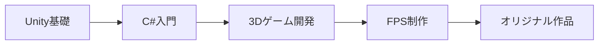

# Unity6とは何か？

## 2026年のUnity開発

GitHub Copilot / Cursor / Claude などのAIコード支援ツールが当たり前になった2026年、**「バイブコーディング」で初心者でも高速開発できる時代になりました**。コードの意味を完全に理解していなくても、AIと対話しながらゲームを形にできます。この本でもAI活用のヒントを随所に入れていますので、ぜひ活用してみてください。

## Unity6の学習ロードマップ

### ゲームからメタバースまで自由自在、無限の創造を支える3D開発プラットフォーム

**Unityは、ゲーム開発やリアルタイム3Dコンテンツ制作のための強力なゲームエンジンです**。初心者からプロフェッショナルまで幅広く支持され、2Dゲーム・スマホアプリ・WebGLコンテンツまで対応可能です。直感的な操作性と豊富なリソースで「誰でも創造をカタチにできる」環境を提供します。

### なぜUnity6を学ぶと良いのか？

- **学習のしやすさ**：  
  Unity公式ドキュメント、チュートリアル、コミュニティが充実しているため、初心者でも独学しやすく、最初のサンプルプロジェクトを動かすまでのハードルが低いのが魅力です。

- **幅広い応用領域**：  
  ゲーム開発はもちろん、**VR/AR**で没入感あふれる体験を作ったり、**メタバース**や**インタラクティブな展示コンテンツ**、果ては**アプリ・Web開発**まで、Unityは活躍の場を選びません。学んだスキルは多方面で活かせ、今後のキャリアや趣味の幅がグッと広がります。

- **豊富なアセットとプラグイン**：  
  Unity Asset Storeをはじめとするリソースが充実しており、モデリングからサウンド、AIプラグインまで、「自分一人でゼロから作る」負担を大幅に軽減できます。プロが使うツールを初心者も同様に利用できるので、短期間で魅力的な作品を形にできます。

### Unity6が対応するプラットフォーム一覧

| **カテゴリ**          | **プラットフォーム**                       |
|-----------------------|-------------------------------------------|
| **デスクトップ**       | Windows, macOS, Linux                     |
| **モバイル**           | iOS, Android, HarmonyOS                   |
| **コンソール**         | PlayStation 4, PlayStation 5              |
|                       | Xbox One, Xbox Series X|S                |
|                       | Nintendo Switch                           |
| **ウェアラブル**       | Android Wear, Apple Watch                 |
| **VR/AR**             | Oculus (Meta Quest), HoloLens             |
|                       | HTC Vive, PlayStation VR, Magic Leap      |
|                       | Pico VR                                   |
| **ウェブ**             | WebGL                                    |

これら多数のプラットフォームへのビルドが可能なため、一度身につけたスキルや作成したプロジェクトは、様々な環境で「届けたい人」に届けることができます。

### Unity6の新機能について

Unity6では、Render GraphやGPU Resident Drawerなどのパフォーマンス向上機能が導入され、より美しく高速なゲームを作れるようになりました。本書では基礎に集中しますが、**Unity6はインディーから大手スタジオまで使われるプロ品質のゲームエンジンです**。基礎をマスターした後は、Unity6の高度な機能を探求していきましょう。

