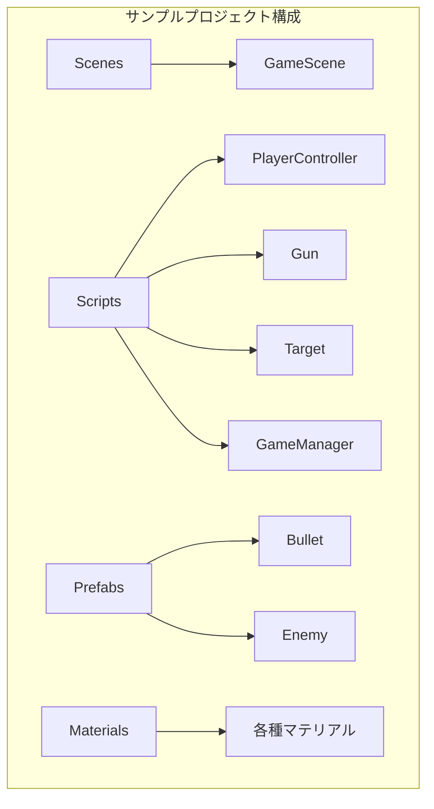

#### サンプルプロジェクトのダウンロード

ゲーム開発を効率的に学習するために、本教材で使用しているサンプルプロジェクトを提供しています。以下のリンクから簡単にダウンロードして、Unityで直接開いて学習を進めることができます。

#### 完成形を先に体験しよう

まずはサンプルプロジェクトを実行して、完成形を体験してみましょう。**自分がこれから作るゲームの全体像を把握してから学ぶと、理解が格段に早くなります**。どんな動きをするのか、どんな画面が出るのかを先に知っておくことで、各章の実装の「意味」が見えてきます。

https://drive.google.com/file/d/1if402vYE6_n3UsPZzvA41-kbsRPHD2_w/view?usp=sharing

#### サンプルプロジェクトの活用方法

**本教材では、サンプルプロジェクトを参考にしながら、実際に手を動かして同じ内容を一から作成していきます。そのため、最初にダウンロードする必要はありません**。

ただし、途中でつまずいた場合や完成形を事前にイメージしたい場合には、閲覧用としてご活用いただけます。自由に参照しながら、学習を進めてください。

#### サンプルプロジェクト構成

#### サンプルプロジェクト内容
- クリア画面UI: ゲーム終了時に表示される画面の実装例。
- ターゲットの物理挙動と当たり判定: Rigidbody と Collider を活用したターゲットの動作サンプル。
- 射撃システム: Raycast を用いた射撃の基礎的な実装。
- スコア管理機能: GameManager を使用してスコアを保存・管理する仕組み。

:::message
**AIにサンプルコードの意味を質問しよう**: サンプルのスクリプトをCursorやChatGPTに貼り付けて「このコードを初心者向けに解説して」と聞くと、各行の意味を丁寧に教えてもらえます。
:::
