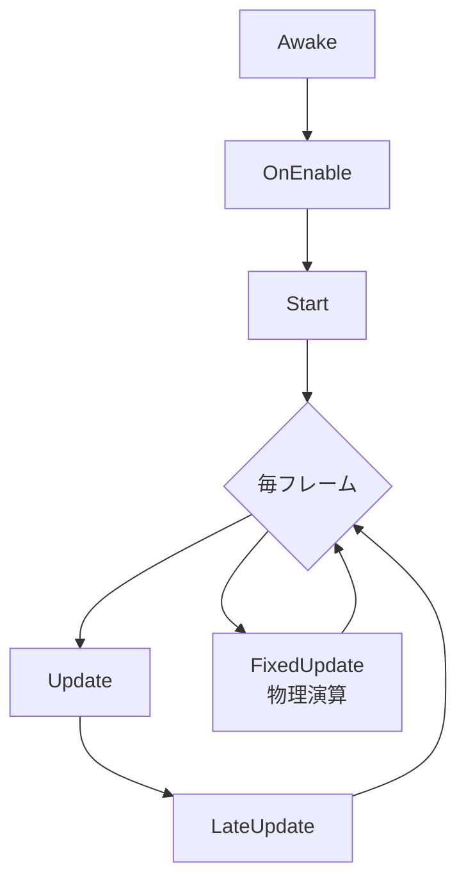
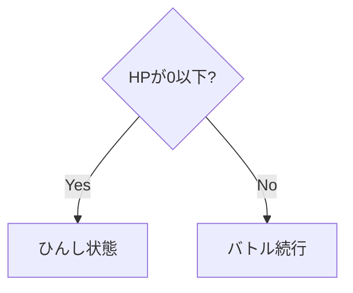
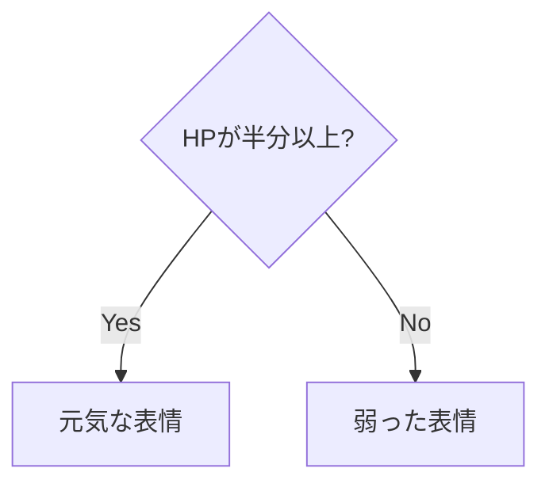
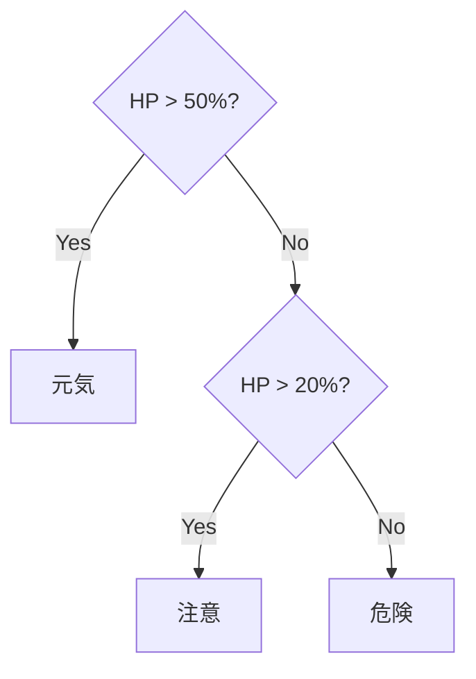
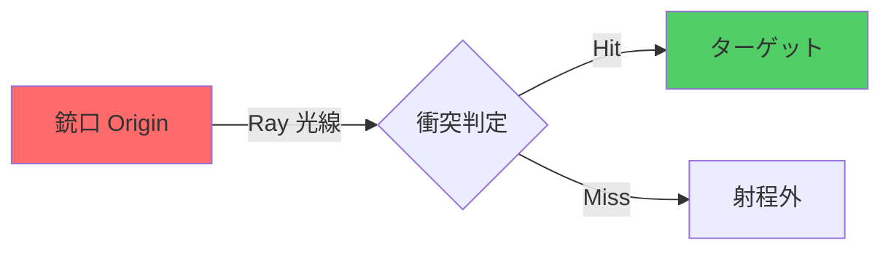

# いつ (トリガー)
スクリプトにおける「いつ（トリガー）」は、操作やイベントが開始されるタイミングを指します。このタイミングにより、スクリプトが指定された条件で実行され、ゲーム内での動作やユーザーインタラクションが制御されます。

以下は、Unityでトリガーとなる`2つの主要なシステム`と`それぞれの役割`について解説します。
1. **InputSystem** : ユーザーの入力をトリガーとして処理を実行します。
2. **Unityのライフサイクル** : ゲーム開始後の時間経過に基づき、特定のタイミングで処理を実行します。

# 1.InputSystem

`InputSystem`は、ユーザーの入力（キーボード、マウス、ゲームパッドなど）を効率的に管理し、さまざまなデバイスからの操作に対応するためのシステムです。`InputSystem`を用いることで、特定の操作が行われたタイミングを「トリガー」として捉え、ゲーム内で対応するアクションを実行できます。

例えば、`右クリック`をした時に、`射撃をする`などのプログラムを**InputSystem**を利用することで組むことができます。


## アクションマップ
**`アクションマップ`は、関連する複数のアクションをまとめて管理するためのコンテナのようなものです**。各アクションマップは特定のゲームの状況やシーンに対応した一連のアクションを集約することができ、状況に応じて異なる入力方式やキー操作を実行します。

たとえば、「戦闘中」や「メニュー操作中」などの状態ごとに異なるアクションマップを用意し、それらを切り替えることでゲームプレイを動的に管理することが可能です。

## アクション
**`アクション`は、プレイヤーの入力に対する特定の反応や動作を定義するものです。**

たとえば、「ジャンプ」や「攻撃」など、プレイヤーが入力する操作を一つのアクションとして設定します。アクションを使うことで、コード内で直接キーコードを扱う必要がなくなり、入力処理を簡潔に管理できます。

## バインド
**`バインド`は、特定のアクションをキーボード、マウス、ゲームパッドのボタンなど、具体的なデバイス操作に結びつける仕組みです**。バインドを使うことで、どのキーやボタンがどのアクションをトリガーするかを定義し、ユーザーが自分好みにキー配置をカスタマイズすることもできます。

例えば、「ジャンプ」アクションに対してキーボードの`スペースキー`やゲームパッドの`Aボタン`をバインドすることで、プレイヤーは異なる入力方法で同じアクションを実行できます。


# 2.Unityのライフサイクル

Unityには、ゲームオブジェクトやスクリプトのライフサイクルを管理するための一連のイベントメソッドがあり、それぞれ異なるタイミングで呼び出されます。これにより、スクリプトの実行順序やタイミングを制御し、複雑なゲームロジックを簡単に構築できます。

## Unityの主要なライフサイクル

| **メソッド**      | **説明**                                                                               | **実行タイミング**                                  |
|-------------------|----------------------------------------------------------------------------------------|----------------------------------------------------|
| **Awake**         | スクリプトがロードされ、ゲームオブジェクトが有効になる前の初期設定を行う                  | スクリプトのインスタンスがロードされたときに一度だけ |
| **Start**         | オブジェクトがアクティブになったときのセットアップ処理                                    | `Awake`の後に一度だけ実行                           |
| **Update**        | 毎フレーム実行され、ユーザー入力やオブジェクトの動きなどリアルタイム処理を行う            | 毎フレーム呼ばれる                                  |
| **OnEnable**      | ゲームオブジェクトやスクリプトが有効化される際に呼び出され、再有効化時にも再び呼ばれる      | オブジェクトが有効化されるたびに実行               |
| **OnDisable**     | ゲームオブジェクトやスクリプトが無効化される際に呼び出される                              | オブジェクトが無効化されるたびに実行               |



# どうしたら (条件)

# 1.bool型
bool型は、真（true）または偽（false）の2つの値のみを取るデータ型です。C#では、条件分岐やフラグ管理、特定の状態の保持など、ロジックをコントロールする際に広く使われます。

## 特徴

•	2値のみを保持：真(true) または 偽(false)。
•	軽量なデータ型：メモリ使用量が少ないため、フラグや状態管理に適しています。
•	条件式と相性が良い：if文やwhile文などの条件判定に直接使用できます。

## 実際のコードで理解する

```csharp:trueを格納する場合
bool isGameOver = true;
```

```csharp:falseを格納する場合
bool isGameOver = false;
```

# 2.演算子
UnityでC#スクリプトを記述する際には、演算子を使用して条件を評価し、プログラムがどう動作するかを決定します。

以下では、比較演算子と論理演算子についてご紹介します。

## 比較演算子
比較演算子は、2つの値を比較し、その結果を真（`true`）または偽（`false`）で返します。条件分岐（`if`文など）に使われ、特定の条件に基づいて処理を分けるために役立ちます。

| 演算子 | 説明               | 例                 | 結果          |
|--------|--------------------|--------------------|---------------|
| `==`   | 等しい             | `5 == 5`          | `true`        |
| `!=`   | 等しくない         | `5 != 3`          | `true`        |
| `>`    | より大きい         | `5 > 3`           | `true`        |
| `<`    | より小さい         | `3 < 5`           | `true`        |
| `>=`   | 以上               | `5 >= 5`          | `true`        |
| `<=`   | 以下               | `3 <= 5`          | `true`        |

## 論理演算子
| 演算子 | 説明                                   | 例                      | 結果     |
|--------|----------------------------------------|-------------------------|----------|
| `&&`   | すべての条件が「真」の場合に`true`を返す | `true && true`          | `true`   |
| `\|\|` | いずれかの条件が「真」の場合に`true`を返す | `true \|\| false`       | `true`   |
| `!`    | 条件の真偽を反転させる                 | `!true`                 | `false`  |

# 3.制御文

**制御文とは、プログラムの流れをコントロールする仕組みです。**

条件に応じて「どの動きにするか」を決めたり、特定の動きを何回も繰り返したりすることができます。
ゲームでは、プレイヤーの行動や状況に応じて「次に何をするか」を決めるために使われます。

>本記事では、代表的なif文をご紹介します。

## 1. if文

`if`文は、指定された条件が真（`true`）である場合にのみ、コードブロック[^2]を実行します。これにより、条件に応じた動作を簡単に実装でき、ゲーム内での様々な状況判断に役立ちます。

## 基本的な文法

```csharp:if文
if (条件式1)
{
    // 条件式がtrueの場合の処理
}
```

## もっと具体的に説明！

次のコードでは、「ポケモンの体力が0以下なら戦闘不能と表示する」処理を`if`文で記述しています。

```csharp:PokemonExample
using UnityEngine;

public class PokemonBattle : MonoBehaviour
{
    int pikachuHealth = 50; // ピカチュウの初期体力
    
    void Update()
    {
        // ピカチュウの体力が0以下なら戦闘不能と表示する
        if (pikachuHealth <= 0)
        {
            Debug.Log("ピカチュウは戦闘不能だ！");
        }
    }
}
```



## 2.if-else文

if-else文は、条件が真の場合と偽の場合で異なる処理を行います。ゲーム内で状態に応じた異なる動作をさせるときに便利です。

## 基本的な文法

`if-else`文は、`if`ブロックの条件が偽（false）のときに`else`ブロックが実行されます。

```csharp
if (条件式)
{
    // 条件式がtrueの場合の処理
}
else
{
    // 条件式がfalseの場合の処理
}
```

## もっと具体的に説明！

次のコードでは、「ピカチュウが技を使えるPP（ポイント）が残っている場合」と「PPがなくなった場合」で異なるメッセージを表示します。

```csharp:Example
using UnityEngine;

public class PokemonExample : MonoBehaviour
{
    int pikachuPP = 5; // ピカチュウの技の残りポイント

    void Update()
    {
        // 技のPPが残っている場合とない場合の処理
        if (pikachuPP > 0)
        {
            Debug.Log("技を使えます！");
        }
        else
        {
            Debug.Log("PPがなくなりました！技を回復してください！");
        }
    }
}
```



## 3. if-else if文

if-else if文は複数の条件を順に評価し、最初に真（true）となったコードブロックを実行します。条件が複数ある場合に役立ち、優先順位を持たせた処理を実装できます。

## 基本的な文法

```csharp
if (条件式1)
{
    // 条件式1がtrueの場合の処理
}
else if (条件式2)
{
    // 条件式2がtrueの場合の処理
}
else
{
    // 全ての条件がfalseの場合の処理
}
```

## もっと具体的に説明！

次のコードでは、「ピカチュウの体力が多い場合」「普通の場合」「少ない場合」で異なるメッセージを表示します。

```csharp:Example
using UnityEngine;

public class PokemonExample : MonoBehaviour
{
    int pikachuHealth = 50; // ピカチュウの現在の体力

    void Update()
    {
        // 体力に応じたメッセージを表示
        if (pikachuHealth > 75)
        {
            Debug.Log("ピカチュウは元気いっぱい！");
        }
        else if (pikachuHealth > 30)
        {
            Debug.Log("ピカチュウは普通の状態です");
        }
        else
        {
            Debug.Log("ピカチュウは瀕死状態です！回復が必要です！");
        }
    }
}
```



:::details その他の制御文
| 制御文        | 説明                                                                                         | 例                                                                                       |
|---------------|----------------------------------------------------------------------------------------------|------------------------------------------------------------------------------------------|
| `switch`      | 複数の値に基づいて異なるコードブロックを実行します。複雑な分岐条件に対応できる便利な方法です。        | `switch (day) { case "月曜": Debug.Log("週の始まり"); break; case "金曜": Debug.Log("週末"); break; }` |
| `for`         | 指定回数だけ繰り返し処理を行います。ループ内で繰り返し操作を実行する際に使用されます。               | `for (int i = 0; i < 5; i++) { Debug.Log(i); }`                                         |
| `while`       | 条件が真（`true`）である間、コードブロックを繰り返し実行します。                                   | `while (hp > 0) { Debug.Log("プレイヤー生存"); hp--; }`                                  |
| `do-while`    | 最初に一度コードブロックを実行し、その後に条件が真（`true`）の間だけ繰り返し実行します。             | `do { Debug.Log("実行中"); hp--; } while (hp > 0);`                                     |
| `foreach`     | 配列やリストの要素を順に繰り返し処理します。                                                     | `foreach (int score in scores) { Debug.Log(score); }`                                    |
| `break`       | ループや`switch`文から即座に抜け出します。                                                      | `for (int i = 0; i < 10; i++) { if (i == 5) break; }`                                   |
| `continue`    | ループ内の残りのコードをスキップし、次のループの反復に進みます。                                    | `for (int i = 0; i < 10; i++) { if (i == 5) continue; Debug.Log(i); }`                  |
:::

# 4.Ray判定

Ray判定は、3D空間で視線や射撃の軌道をシミュレートするための強力な手法です。`RaycastHit` オブジェクトを使って、レイがオブジェクトと交差したかどうかを検出できます。



## 基本的な文法

`Physics.Raycast`メソッドを用いてレイキャストを実行します。以下は基本的な構文です。
```csharp
Physics.Raycast(レイの開始位置, レイの方向, out RaycastHit hit情報, レイの最大距離);
```

## もっと具体的に説明！

```csharp:Example
using UnityEngine;

public class Example : MonoBehaviour
{
    void Update()
    {
        RaycastHit hit;
        if (Physics.Raycast(transform.position, transform.forward, out hit, 100))
        {
            Debug.Log("ヒット: " + hit.collider.name); // ヒットしたオブジェクトの名前を表示
        }
    }
}
```
:::details C#スクリプトの解説
> 6行目 : `RaycastHit hit;`
ここでは、`RaycastHit`型の変数`hit`を宣言しています。`RaycastHit`は、レイがオブジェクトにヒットした際に、そのオブジェクトに関する情報（例：オブジェクト名、衝突位置など）を格納する構造体です。`hit`変数により、レイキャストで当たったオブジェクトの詳細情報を取得できます。

> 7行目 : `if (Physics.Raycast(transform.position, transform.forward, out hit, 100))`
この行は`Physics.Raycast`メソッドを使ってレイキャスト（光線を投射して衝突を検出）を行う部分です。`transform.position`でレイの発射位置を、`transform.forward`でレイの向きを指定しています。`out hit`は、レイが何かに当たったときにその情報を`hit`に格納することを意味しています。`100`はレイの最大距離を示し、ここでは100単位先までレイが飛びます。この条件が`true`の場合、次のブロック内の処理が実行されます。

> 9行目 : `Debug.Log("ヒット: " + hit.collider.name);`
`Debug.Log`メソッドを使って、コンソールにレイがヒットしたオブジェクトの名前を出力しています。`hit.collider.name`でヒットしたオブジェクトのコライダー名を取得し、`"ヒット: "`という文字列に結合して表示します。これにより、ヒットしたオブジェクトの名前が「ヒット: オブジェクト名」という形式で表示されます。
:::

### 実行結果

このコードを実行すると、レイが前方100単位内のオブジェクトに当たった場合、そのオブジェクトの名前が「Hit: オブジェクト名」という形式でコンソールに表示されます。
>`Hit: オブジェクト名`

# 何をするのか? (アクション)

# 1. オブジェクトの取得

オブジェクトをプログラム上で取得し、操作を行うためには、まずそのオブジェクトを検索して参照を持つ必要があります。

## 基本的な文法

```csharp
GameObject.Find("オブジェクト名");
```

## もっと具体的に説明！

以下のスクリプトは、指定した名前のオブジェクトを取得して、その名前をコンソールに表示します。

```csharp
using UnityEngine;

public class Example : MonoBehaviour
{
    void Start()
    {
        GameObject targetObject = GameObject.Find("TargetObject");
        if (targetObject != null)
        {
            Debug.Log("オブジェクトを取得しました: " + targetObject.name);
        }
        else
        {
            Debug.Log("指定されたオブジェクトは見つかりませんでした。");
        }
    }
}
```
:::details C#スクリプトの解説
>5行目 : GameObject targetObject = GameObject.Find("TargetObject");
指定した名前のオブジェクトを検索し、変数targetObjectに格納します。

>6行目 : if (targetObject != null)
取得したオブジェクトが存在する場合の条件分岐です。

>7行目 : Debug.Log("オブジェクトを取得しました: " + targetObject.name);
オブジェクトが取得できた場合、その名前をコンソールに表示します。
:::

## 実行結果
   - 「オブジェクトを取得しました: TargetObject」とコンソールに表示される（オブジェクトが見つかった場合）。
   - 「指定されたオブジェクトは見つかりませんでした」とコンソールに表示される（オブジェクトが見つからない場合）。

# 2.オブジェクトの生成

Unityで新しいオブジェクトを生成する際は、Instantiateメソッドを使用します。

## 基本的な文法

```csharp
Instantiate(生成するオブジェクト, 位置, 回転);
```

## もっと具体的に説明！

以下のスクリプトは、指定した位置にオブジェクトを生成します。

```csharp
using UnityEngine;

public class Example : MonoBehaviour
{
    public GameObject prefab;

    void Start()
    {
        Instantiate(prefab, new Vector3(0, 0, 0), Quaternion.identity);
    }
}
```
:::details C#スクリプトの解説
>5行目 : Instantiate(prefab, new Vector3(0, 0, 0), Quaternion.identity);
指定したプレハブを位置(0, 0, 0)、回転Quaternion.identityで生成します。
:::

## 実行結果
**オブジェクトの生成**
   - 指定した位置と回転で、シーンにプレハブが生成されます。

# 3.オブジェクトの破壊

オブジェクトを削除するには、Destroyメソッドを使用します。

## 基本的な文法

```csharp
Destroy(オブジェクト, 破壊までの遅延時間);
```
## もっと具体的に説明！

以下のスクリプトは、指定したオブジェクトを2秒後に破壊します。

```csharp
using UnityEngine;

public class Example : MonoBehaviour
{
    public GameObject targetObject;

    void Start()
    {
        Destroy(targetObject, 2.0f); // 2秒後にオブジェクトを破壊
    }
}
```
:::details C#スクリプトの解説
>7行目 : Destroy(targetObject, 2.0f);
>targetObjectを2秒後に破壊します。
:::

## 実行結果
**オブジェクトの破壊**
   - スクリプト開始から2秒後に、`targetObject`が破壊され、シーンから消えます。

# 4.コンポーネントの取得

オブジェクトにアタッチされたコンポーネントを取得するには、GetComponentメソッドを使用します。

## 基本的な文法

```csharp
GetComponent<コンポーネントタイプ>();
```

## もっと具体的に説明！

以下のスクリプトは、オブジェクトにアタッチされたRigidbodyコンポーネントを取得します。

```csharp
using UnityEngine;

public class Example : MonoBehaviour
{
    private Rigidbody rb;

    void Start()
    {
        rb = GetComponent<Rigidbody>();
    }
}
```
:::details C#スクリプトの解説
>5行目 : rb = GetComponent<Rigidbody>();
Rigidbodyコンポーネントを取得し、変数rbに格納します。
:::

## 実行結果
**コンポーネントの取得**
   - `Start`メソッド内で`Rigidbody`コンポーネントを取得（エラーがなければ、取得成功）。

# 5.オブジェクトの表示・非表示

オブジェクトの表示・非表示を切り替えるには、SetActiveメソッドを使用します。

## 基本的な文法

```csharp
オブジェクト.SetActive(true or false);
```

## もっと具体的に説明！

以下のスクリプトは、スペースキーを押すたびにオブジェクトの表示・非表示を切り替えます。

```csharp
using UnityEngine;

public class Example : MonoBehaviour
{
    public GameObject targetObject;

    void Start()
    {
        ToggleVisibility();
    }

    void ToggleVisibility()
    {
        // 現在の状態を反転させて表示/非表示を切り替える
        targetObject.SetActive(!targetObject.activeSelf);
    }
}
```
:::details C#スクリプトの解説
>8行目 : targetObject.SetActive(!targetObject.activeSelf);
Spaceキーが押されるたびに、targetObjectの表示状態を切り替えます。
:::
>

## 実行結果
**オブジェクトの表示・非表示**
   - スタート時に、指定したオブジェクトの表示・非表示が切り替わります。